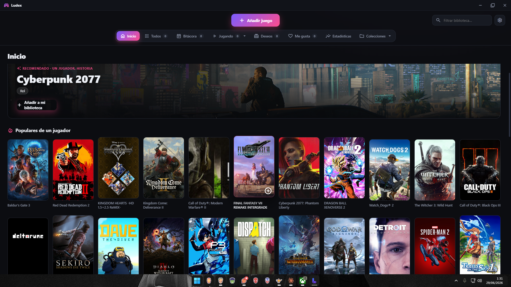
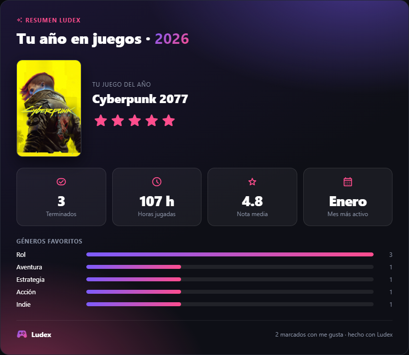
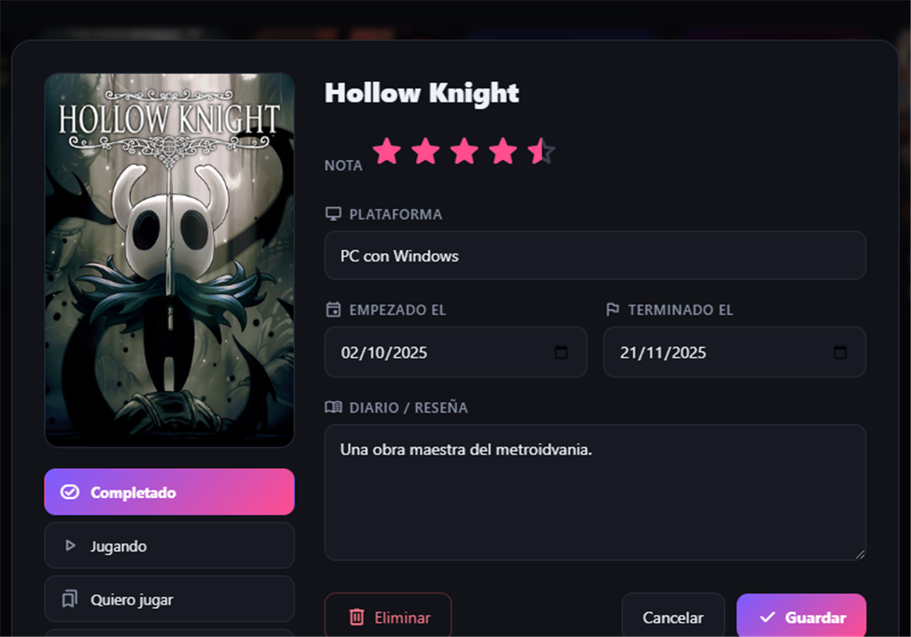
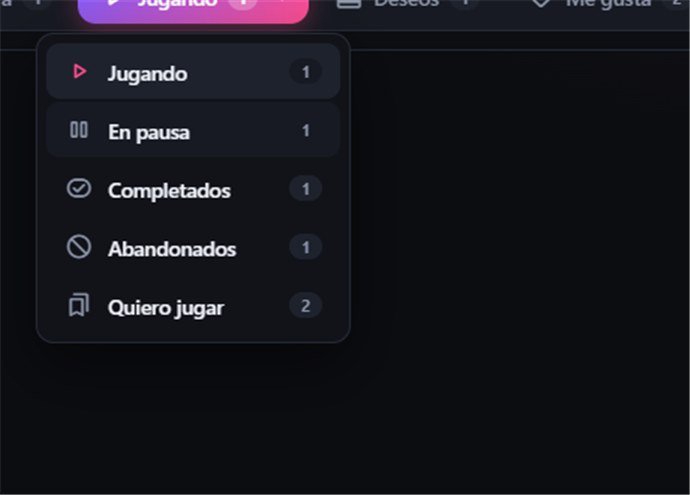

<div align="center">


# Ludex

**A sua biblioteca pessoal de videojogos** — registe o que joga, o que quer jogar e o que já concluiu, com notas, datas, diário, estatísticas e descoberta de jogos para um jogador.

[English](README.md) · [Español](README.es.md) · [Français](README.fr.md) · **Português**

[](https://github.com/Xzorez/ludex/releases/latest)
[](LICENSE)


</div>

---

O Ludex é uma **aplicação de ambiente de trabalho para Windows** (não é um site) feita com Electron. Usa o
**catálogo da Steam** para procurar jogos e obter capas, géneros, descrições, capturas e
os tempos do **HowLongToBeat** — tudo **sem chave de API nem início de sessão**. Os seus dados são
guardados **apenas no seu PC**.

## Funcionalidades

- **Biblioteca por estado**: A jogar, Em pausa, Concluídos, Abandonados, Quero jogar e Lista de desejos.
- **Adicione jogos manualmente** (fora da Steam) com a sua própria capa — exclusivos de consola, retro, jogos físicos.
- **Preços nos Desejos**: preço atual da Steam e selo de desconto em cada jogo da lista de desejos.
- **Aleatório com filtros** (estado, género/etiqueta e duração do HowLongToBeat) para decidir o que jogar.
- **Nota por estrelas** (meias incluídas), **data de conclusão**, **etiquetas** e um **diário/análise** (com ocultação opcional de spoilers).
- **Diário cronológico** dos jogos que termina, agrupado por mês.
- **Coleções personalizadas** para agrupar jogos à sua maneira.
- **Filtros** por género e etiqueta, além da pesquisa na sua biblioteca.
- **Ficha detalhada** (da Steam): descrição, géneros, data de lançamento, criador, capturas (com visualizador) e horas do **HowLongToBeat**.
- **Estatísticas** e um **Resumo do ano (Wrapped)** exportável como imagem para partilhar.
- **Início** com recomendações de jogos para um jogador / história (os mais populares e mais desejados na Steam), ocultando os que já tem.
- **Personalização**: 10 cores de destaque, temas, tamanho das capas e fundo dinâmico.
- **Barra de título própria**, ecrã de arranque animado e **cópia de segurança** (exportar/importar).
- **Quatro idiomas** (espanhol, inglês, francês e português) e um ecrã inicial para escolher idioma e tema.
- **Atualização automática**: atualiza-se a partir das releases do GitHub.

## Capturas

<div align="center">

| Início | Resumo do ano |
| :---: | :---: |
|  |  |

| Ficha do jogo | Menu de estado |
| :---: | :---: |
|  |  |

</div>

## Descarregar

1. Vá a **[Releases](https://github.com/Xzorez/ludex/releases/latest)** e descarregue **`Ludex-Setup-x.y.z.exe`**.
2. Execute-o e siga o instalador.

> Como não está assinado digitalmente, o Windows pode mostrar o **SmartScreen**: clique em
> *Mais informações -> Executar mesmo assim*.

Após a instalação, **o Ludex atualiza-se sozinho**: ao arrancar, verifica se há uma nova versão,
descarrega-a em segundo plano e pede-lhe para reiniciar e instalar.

### Onde são guardados os meus dados?

Em `C:\Users\<o seu utilizador>\AppData\Roaming\Ludex\games.json`. Sem nuvem, sem contas, sem telemetria.
Pode copiar esse ficheiro como cópia de segurança (ou usar **Definições -> Exportar biblioteca**).

## Compilar a partir do código

Requer [Node.js](https://nodejs.org).

```bash
npm install      # instalar dependências
npm start        # executar em modo de desenvolvimento
npm run dist     # gerar o instalador em release\
```

### Estrutura do projeto

```
assets/                  Ícone da app e do instalador
docs/screenshots/        Capturas para o README
src/
  main.js                Processo principal (dados, Steam, HLTB, atualizações)
  preload.js             Ponte segura renderer <-> processo principal
  renderer/
    index.html           Interface
    styles.css           Estilos (tema escuro, responsivo)
    app.js               Lógica da interface
    assets/              Tipo de letra de ícones Material Symbols (local)
```

### Tecnologia

- **Electron** (sem frameworks de UI) + **electron-builder** (instalador NSIS) + **electron-updater** (atualização automática).
- Ícones: **Material Symbols** da Google, incorporados localmente.
- Dados dos jogos: APIs públicas da **Steam** (`storesearch`, `appdetails`, `featuredcategories`, pesquisa com filtros) e **HowLongToBeat** — sem chave de API.

> Nota ao compilar no Windows: se a primeira build falhar ao descompactar o `winCodeSign`
> (ligações simbólicas do macOS), ative o **Modo de programador** do Windows ou execute o terminal como administrador.

## Contribuir

*Issues* e *pull requests* são bem-vindas. Encontrou um erro ou tem uma ideia? Abra uma issue.

## Licença

[MIT](LICENSE) — livre para usar, modificar e partilhar.

A licença MIT obriga a manter o aviso de copyright (`Jose Luis (Xzorez)`) em qualquer cópia ou derivado. Se reutilizar este código, um **crédito visível** no ecrã de informações/créditos da sua app é muito apreciado.

<div align="center">
<sub>Feito com Electron.</sub>
</div>
